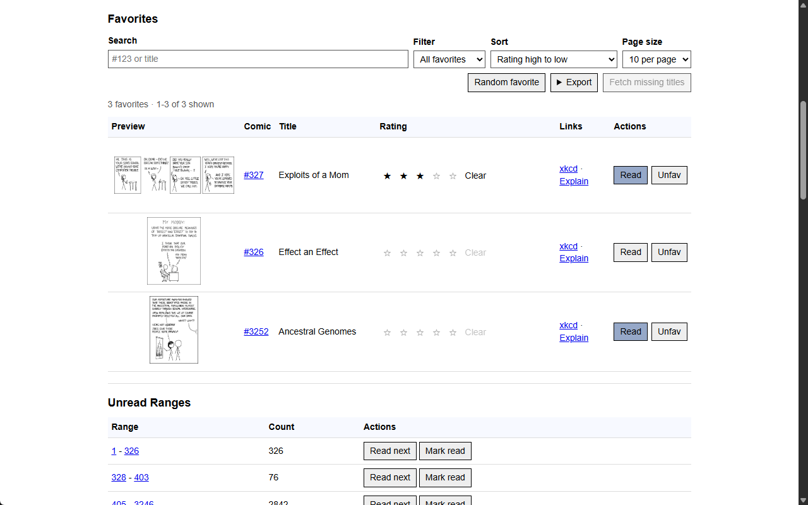
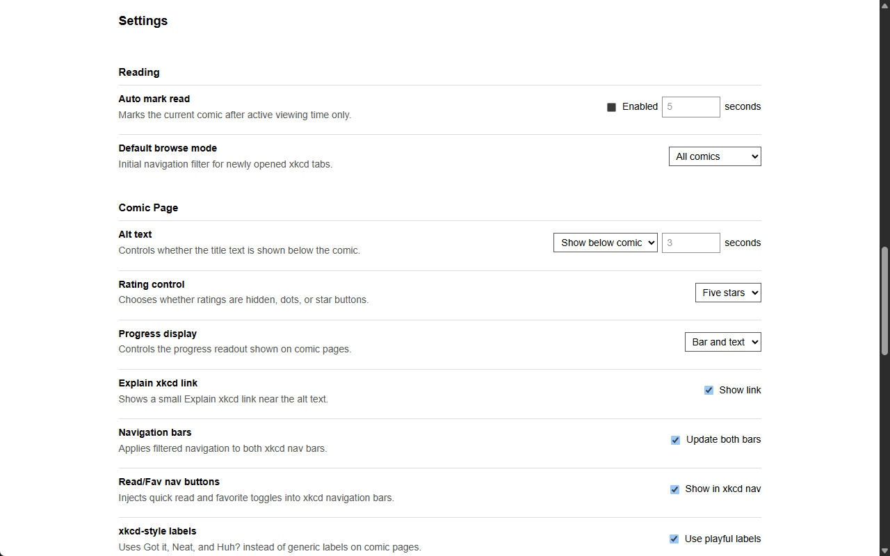
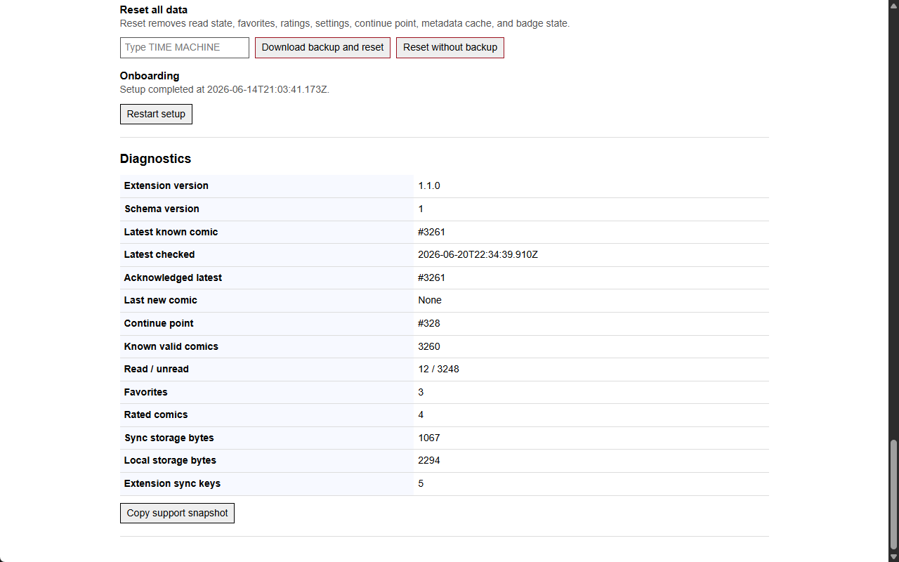
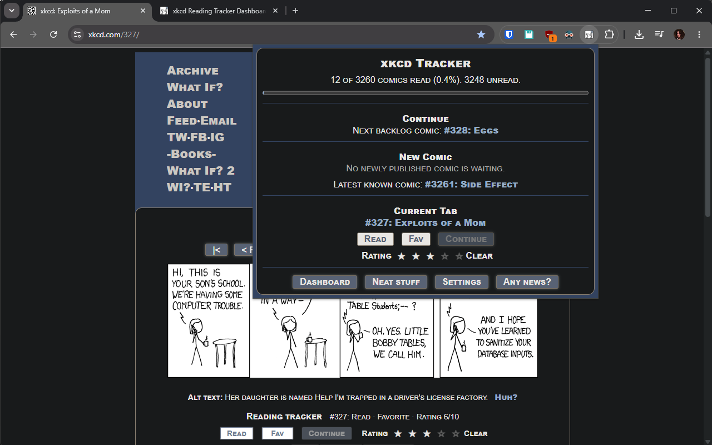

# xkcd Reading Tracker

[](https://github.com/Wolfsblvt/xkcd-reading-tracker/blob/main/manifest.json)
[](https://chromewebstore.google.com/detail/xkcd-reading-tracker/daemkaclgpcpeekkhnnkleeajbhnbkmd)
[](https://chromewebstore.google.com/detail/xkcd-reading-tracker/daemkaclgpcpeekkhnnkleeajbhnbkmd)
[](https://github.com/Wolfsblvt/xkcd-reading-tracker/releases/latest)
[](https://github.com/Wolfsblvt/xkcd-reading-tracker/actions/workflows/tests.yml)
[](https://codecov.io/gh/Wolfsblvt/xkcd-reading-tracker)
[](LICENSE)

A quiet, local-first Chrome extension for keeping your place in xkcd. It adds restrained controls to comic pages, a compact popup, and a fuller dashboard without replacing xkcd's own reading surface.

[](https://chromewebstore.google.com/detail/xkcd-reading-tracker/daemkaclgpcpeekkhnnkleeajbhnbkmd)


## What it does

- Tracks read state, favorites, ratings, and a separate continue-reading point.
- Browses all, unread, or favorite comics through xkcd-style navigation.
- Adds optional quick actions, keyboard shortcuts, accessible alt text, and an Explain xkcd link.
- Provides progress, statistics, unread ranges, bulk actions, and a searchable favorites library.
- Exports favorites and complete JSON backups, validates imports, and offers backup-first reset.
- Notices newly published comics and protects synchronized changes from temporary Chrome Sync throttling.
- Keeps reading data in Chrome extension storage with no account, backend, analytics, telemetry, or remote code.

## Install

Install the published extension from the [Chrome Web Store](https://chromewebstore.google.com/detail/xkcd-reading-tracker/daemkaclgpcpeekkhnnkleeajbhnbkmd), or load this repository directly:

1. Open `chrome://extensions`.
2. Enable **Developer mode**.
3. Choose **Load unpacked**.
4. Select the repository root.
5. Open an xkcd comic such as [xkcd #1](https://xkcd.com/1/).

Chrome 120 or newer is supported. The extension uses Manifest V3 and has no production build step.

## Use

- On a comic page, use the tracker panel and optional navigation-bar actions.
- Open the toolbar popup for quick current-comic actions and reading progress.
- Open the dashboard for setup, statistics, favorites, unread ranges, settings, backups, reset, and diagnostics.

<details>
<summary>More screenshots</summary>

### Toolbar popup


### Dashboard overview


### Favorites library



### Dashboard settings



### Dashboard diagnostics



### Dark mode



</details>

## Privacy

Reading state stays in Chrome extension storage and may synchronize through Chrome when browser sync is enabled. The extension does not request browser-history access or send reading state to the developer. It fetches only public xkcd metadata and images needed for current features.

See [Privacy and data](docs/PRIVACY-AND-DATA.md) for the complete data boundary and [Security](docs/SECURITY.md) for permissions, trust boundaries, and private vulnerability reporting.

## Develop

Node.js 22 or newer is used for repository checks and packaging; the extension itself has no runtime dependencies.

```powershell
npm test
npm run package
```

Asset regeneration is separate and explicit:

```powershell
npm run assets
```

Start with [Development](docs/DEVELOPMENT.md), then use [Architecture](docs/ARCHITECTURE.md) for the system shape. [Product Vision](docs/VISION.md) and [Direction](docs/DIRECTION.md) carry the provisional product lens and current next cuts.

## License

Licensed under [AGPL-3.0-or-later](LICENSE). xkcd Reading Tracker is unofficial and is not affiliated with or endorsed by xkcd or Randall Munroe.
