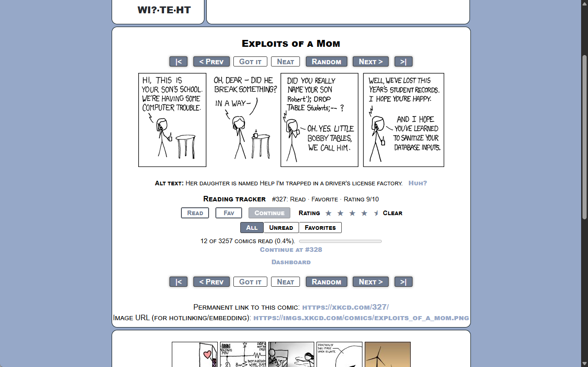
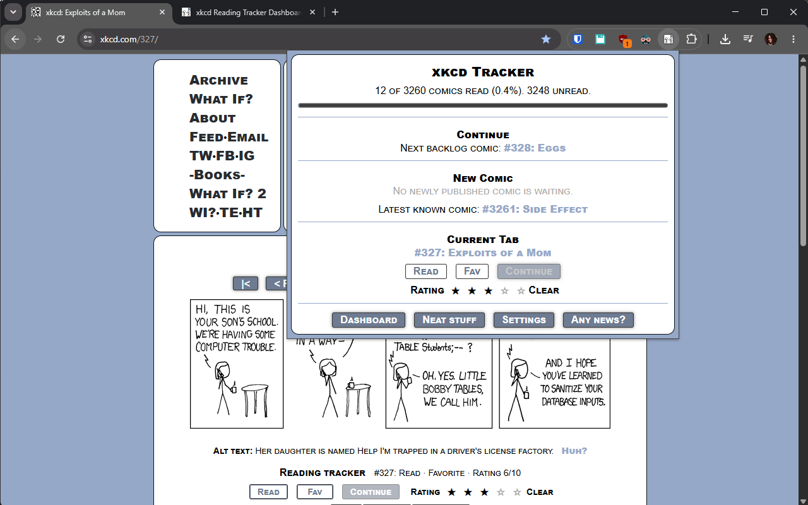
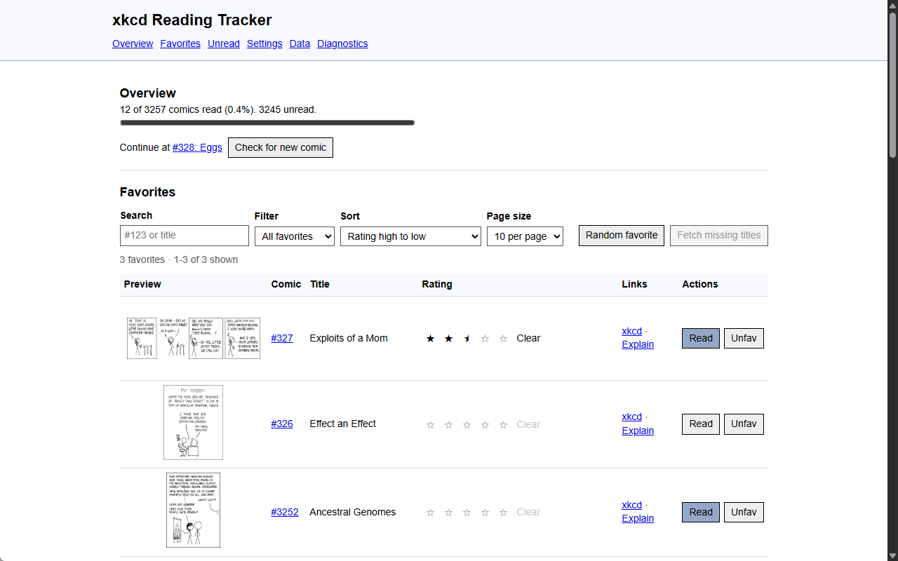
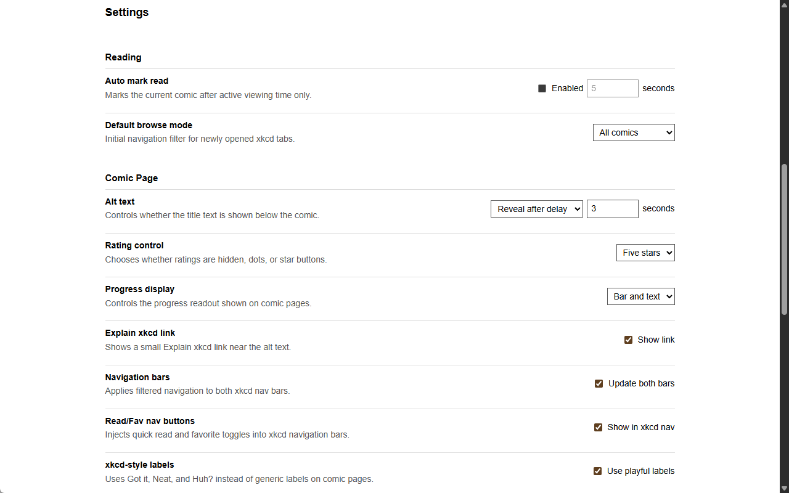
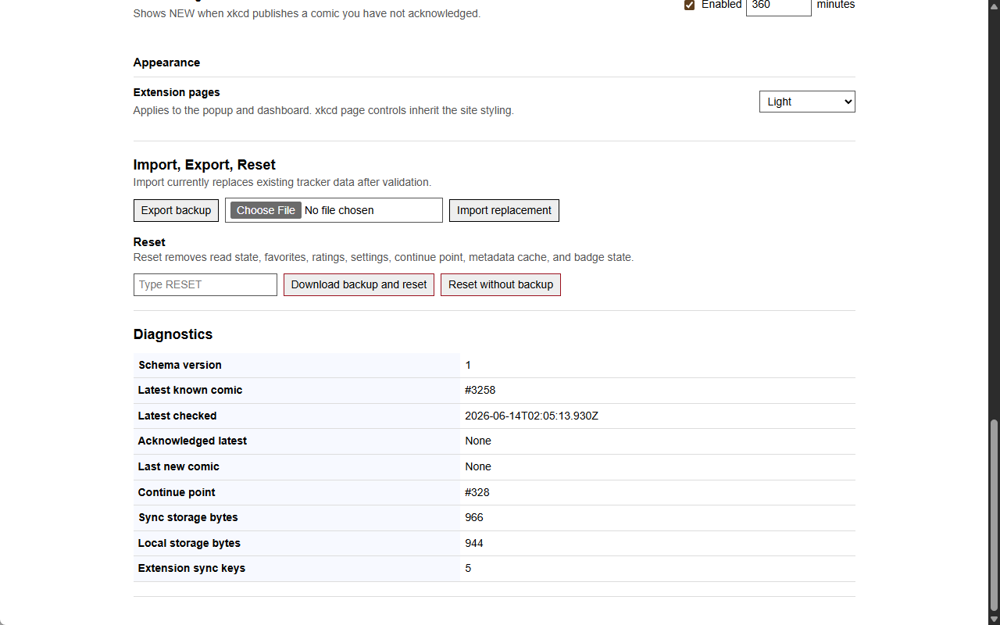

# xkcd Reading Tracker

[](https://github.com/Wolfsblvt/xkcd-reading-tracker)
[](https://chromewebstore.google.com/detail/xkcd-reading-tracker/daemkaclgpcpeekkhnnkleeajbhnbkmd)
[](https://chromewebstore.google.com/detail/xkcd-reading-tracker/daemkaclgpcpeekkhnnkleeajbhnbkmd)
[](https://github.com/Wolfsblvt/xkcd-reading-tracker/releases/latest)
[](https://github.com/Wolfsblvt/xkcd-reading-tracker/actions/workflows/tests.yml)
[](https://developer.chrome.com/docs/extensions/develop/migrate/what-is-mv3)
[](https://www.google.com/chrome/)

A small Chrome extension for tracking xkcd reading progress directly on xkcd.com.

It adds restrained controls to comic pages, keeps state in Chrome extension storage, and provides a compact popup plus a fuller dashboard for management tasks.



<details>
<summary>More screenshots</summary>

### Toolbar Popup



### Dashboard Overview



### Dashboard Settings



### Dashboard Diagnostics



</details>

## Features

- Mark individual comics read or unread.
- Favorite comics independently from read state.
- Store an optional canonical 1-10 rating.
- Keep a dedicated continue-reading point.
- Browse normal xkcd, unread comics, or favorite comics.
- Optionally add quick read/favorite toggles to xkcd's own navigation bars.
- Use xkcd-style nav labels (`Got it`, `Neat`, `Huh?`) or generic labels.
- Show xkcd alt text below the comic or after active-viewing delay.
- Open the matching Explain xkcd page with a small `Huh?` or `Explain` link.
- View reading progress and unread ranges.
- Search, filter, sort, page through, preview, and randomly open favorite comics from the dashboard.
- Jump to unread range starts/ends and set a range as the next reading anchor.
- Bulk mark comic numbers or ranges.
- Export and import complete JSON backups of user-created state.
- Reset data with an optional backup-first flow.
- Check for newly published comics and show a toolbar badge.
- Use light, dark, or system appearance for extension pages.

## Local Installation

1. Open `chrome://extensions`.
2. Enable **Developer mode**.
3. Choose **Load unpacked**.
4. Select this repository folder.
5. Open an xkcd comic page such as `https://xkcd.com/1/`.

## Usage

On xkcd comic pages, use the injected tracker panel below the comic to mark read state, favorite, rate, set the continue point, change browse mode, open Explain xkcd, and view progress.

Use the toolbar popup for quick progress, current-tab controls, new-comic status, unread preview, and compact bulk marking.

Use the dashboard/options page for settings, searchable favorite comics with lazy thumbnails, unread ranges, import/export, reset, and diagnostics.

## Development

The extension source is loaded directly by Chrome. There is no production build step and no runtime dependency install is required.

Checks:

```powershell
npm test
```

Build the Chrome Web Store upload package:

```powershell
npm run package
```

The package script regenerates image assets first, then writes `dist/xkcd-reading-tracker-v<version>.zip` with only the files needed by the extension.

Regenerate image assets without packaging:

```powershell
npm run assets
```

Source artwork lives in `assets/source/`. Generated runtime icons live in `assets/icons/`. Generated Chrome Web Store promo images live in `assets/store/promo/` and are not included in the extension upload zip.

## Browser Requirements

Chrome 120 or newer is targeted. The extension uses Manifest V3, module extension pages, a module service worker, `chrome.storage`, `chrome.alarms`, and static content-script injection.

## Privacy Policy

Reading state is stored through Chrome extension storage. Chrome may synchronize `chrome.storage.sync` data through the signed-in Google account if browser sync is enabled. The extension does not run a server, does not include analytics or tracking, and does not collect, sell, or share reading state with the developer or third-party services. Public xkcd metadata and thumbnail images may be fetched from xkcd domains.

## Known Limitations

- Browser behavior still needs manual validation after loading or reloading the unpacked extension.
- The first version is Chrome-focused.
- Favorite titles and thumbnail URLs are cached only as needed, so title search and previews improve after metadata is fetched.
- Import replaces current data; merge import is future work.
- Chrome sync is managed by Chrome and may not be immediate or cross-browser.
