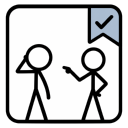
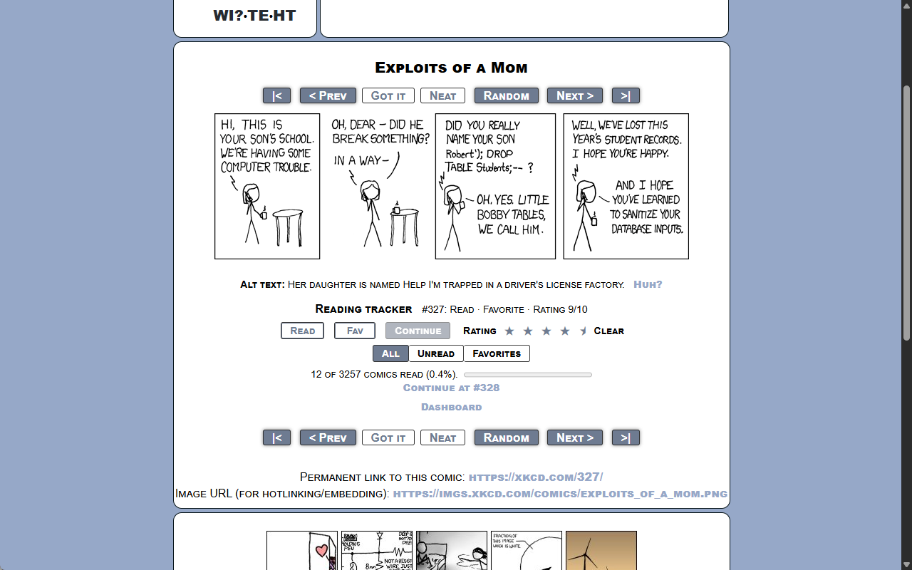
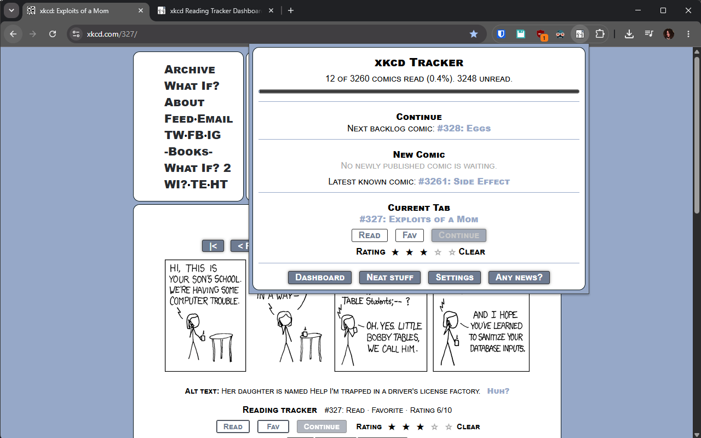
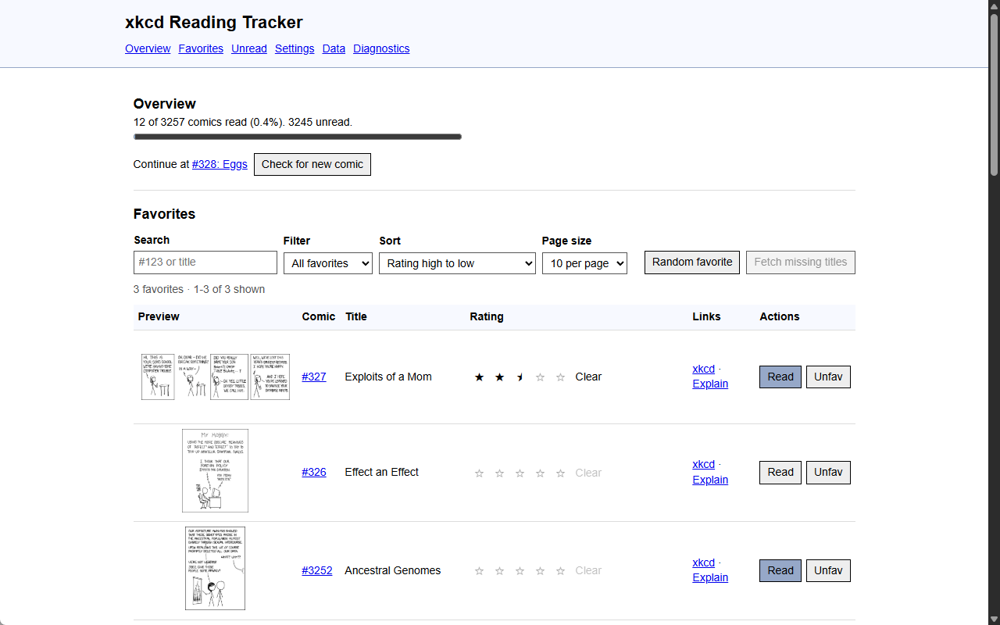
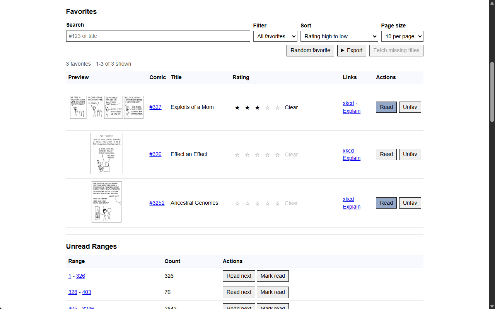
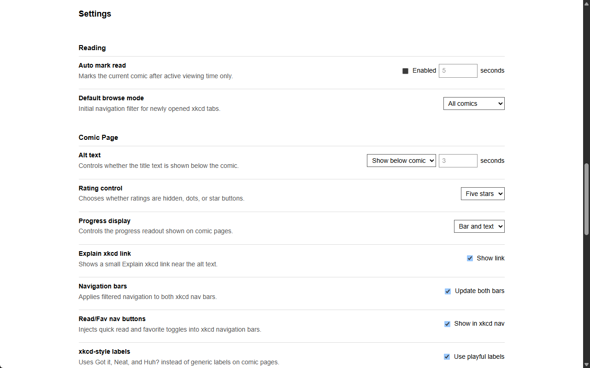
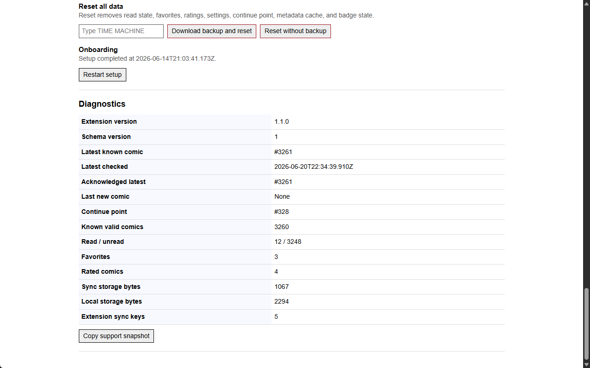
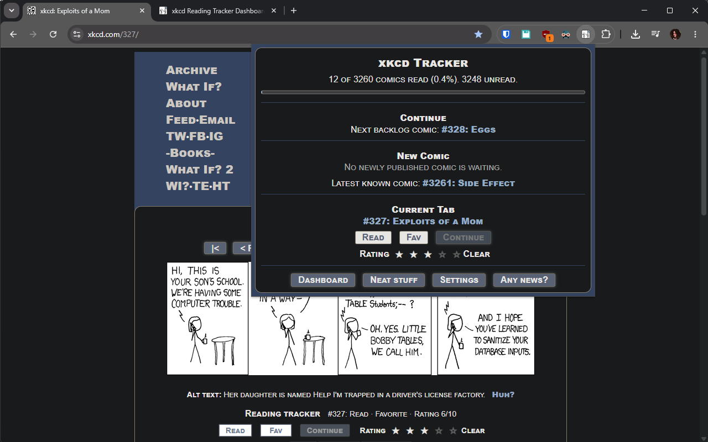

#  xkcd Reading Tracker

[](manifest.json)
[](https://chromewebstore.google.com/detail/xkcd-reading-tracker/daemkaclgpcpeekkhnnkleeajbhnbkmd)
[](https://chromewebstore.google.com/detail/xkcd-reading-tracker/daemkaclgpcpeekkhnnkleeajbhnbkmd)
[](https://github.com/Wolfsblvt/xkcd-reading-tracker/releases/latest)
[](https://github.com/Wolfsblvt/xkcd-reading-tracker/actions/workflows/tests.yml)
[](https://codecov.io/gh/Wolfsblvt/xkcd-reading-tracker)
[](LICENSE)

**Keep your place in xkcd without moving the reading experience somewhere else.**

xkcd Reading Tracker is an unofficial Chrome extension that adds a small reading panel to comic pages, quick controls to the toolbar, and a dashboard for the long view. Track what you have read, save favorites, rate comics, and return to exactly where you stopped while xkcd itself remains the reading surface.

**Status:** published and maintained for Chrome 120 or newer. The source, GitHub release, and Chrome Web Store badges are deliberately separate because those are distinct publication surfaces.

[](https://chromewebstore.google.com/detail/xkcd-reading-tracker/daemkaclgpcpeekkhnnkleeajbhnbkmd)



## Make your first mark

1. Install the extension from the Chrome Web Store.
2. Open any numbered comic, such as [xkcd #1](https://xkcd.com/1/).
3. Look directly below the comic for the **Reading tracker** panel.
4. Select **Read**. The comic status changes to **Read** and the progress count updates immediately.

That visible state change is the first success signal; no tracker account or initial import is required. The optional guided setup in the dashboard can then start from the beginning, mark everything through a chosen comic as read, continue at a chosen comic, or begin caught up.

### Load the source directly

The repository root is the unpacked extension; there is no production build step.

1. Clone or download this repository.
2. Open `chrome://extensions`.
3. Enable **Developer mode**.
4. Choose **Load unpacked** and select the repository root.
5. Open or refresh an xkcd comic page.

The supported browser boundary is Chrome 120 or newer. Compatibility with Firefox or other Chromium-based browsers is not currently claimed.

## Three surfaces, one reading state

| Surface | Best for |
| --- | --- |
| **Comic page** | Marking the current comic read or unread, favoriting, rating, choosing a continue point, switching between all/unread/favorite navigation, viewing alt text, and opening Explain xkcd. |
| **Toolbar popup** | Quick current-comic actions, reading progress, the latest-comic notice, and a short route into setup or the dashboard. |
| **Dashboard** | Guided setup, progress and statistics, unread ranges and bulk actions, the searchable favorites library, settings, backups, reset, and diagnostics. |

Optional page actions include keyboard shortcuts, automatic read marking after active reading time, xkcd-style labels, progress display, and controls added to xkcd's navigation bars. Favorites remain independent from read state, and ratings can use five-star or 1–10 controls.

<details>
<summary>See the popup, dashboard, favorites, settings, diagnostics, and dark mode</summary>

### Toolbar popup



### Dashboard overview



### Favorites library



### Dashboard settings



### Dashboard diagnostics



### Dark mode



</details>

## Back up, restore, or reset

The dashboard can export a complete JSON backup containing reading state, favorites, ratings, the continue point, settings, and the metadata needed to validate a later restore.

Import is a **replacement restore**, not a merge: a valid backup replaces the current tracker data. Export a fresh backup first when the current state still matters.

Restoring default settings preserves reading data. Full reset removes tracker state, cached public xkcd metadata, and session-scoped state; it requires typed confirmation and offers a backup-first route. Uninstall retention and Chrome Sync retention are controlled by Chrome because this project has no developer-side account or data service.

Favorites can also be exported separately as CSV, Markdown, or JSON for reading and sharing; those exports are not complete restorable backups.

## Privacy and permissions

Local-first does not mean device-only. User-created reading state and synchronized settings live in `chrome.storage.sync`, so Chrome may synchronize them through the reader's signed-in Google account when browser sync is enabled. Rebuildable public xkcd metadata and the pending-write journal live in `chrome.storage.local`; tab-scoped browse mode and short-lived dashboard preferences use `chrome.storage.session`.

The Manifest V3 extension requests only:

| Access | Purpose |
| --- | --- |
| `storage` | Save tracker state, settings, cached public metadata, and pending synchronized writes. |
| `alarms` | Check for newly published comics and recover pending Chrome Sync writes. |
| `https://xkcd.com/*` and `https://www.xkcd.com/*` | Add the reading surface to xkcd pages and fetch public comic metadata. |

Dashboard previews may display comic images hosted by `https://imgs.xkcd.com`; executable code still remains packaged with the extension.

The shipped runtime has no tracker account system, developer-operated backend, analytics, telemetry, advertising, remote log collector, or remote executable code. It does not request browser-history access or broad access to unrelated sites. Explain xkcd is opened as an ordinary link; the extension neither reads nor embeds that site's content.

Read [Privacy and data](docs/PRIVACY-AND-DATA.md) for collection, storage, export, and deletion details, and [Security](docs/SECURITY.md) for the permission and trust boundaries.

## Current boundaries

- Chrome 120 or newer is the only supported browser boundary currently declared.
- The comic-page integration depends on xkcd's live document structure and public metadata endpoints; a substantial xkcd change can require an extension update.
- Explain xkcd support is navigation only. The extension does not infer that an explanation was read.
- Complete backup import replaces current data; conflict-aware merge import is not implemented.
- Automated tests cover manifest, storage, data, and package contracts, but they do not prove live Chrome injection, rendering, service-worker lifecycle, alarms, or xkcd DOM behavior. Those have a separate [manual QA route](docs/manual-qa.md).
- Source changes, a GitHub release, and Chrome Web Store publication are separate maintainer actions. A green source candidate is not automatically a Store update.

## Develop

The extension is plain JavaScript, HTML, and CSS with no runtime packages, bundler, or dependency installation step. Node.js 22 or newer is used for repository checks and packaging.

```powershell
npm test
npm run test:coverage
npm run package
```

Run `npm run assets` only when intentionally regenerating committed icons, Store images, or the social preview. Use [Development](docs/DEVELOPMENT.md) for the complete local route and [Releasing](docs/RELEASING.md) for the package, browser-QA, and publication boundaries.

The [documentation map](docs/README.md) links the maintained architecture, data model, decisions, product vision, direction, privacy, and security sources. Report ordinary bugs through [GitHub Issues](https://github.com/Wolfsblvt/xkcd-reading-tracker/issues); report sensitive vulnerabilities through GitHub's private [security advisory route](https://github.com/Wolfsblvt/xkcd-reading-tracker/security/advisories/new).

## License

The extension code is licensed under [AGPL-3.0-or-later](LICENSE), allowing use, modification, and sharing while preserving source access, including for users interacting with modified versions over a network.

That software licence does not grant rights to xkcd's comics, name, or artwork. xkcd publishes its work under [Creative Commons Attribution-NonCommercial 2.5](https://xkcd.com/license.html); xkcd Reading Tracker is unofficial and is not affiliated with or endorsed by xkcd or Randall Munroe.
